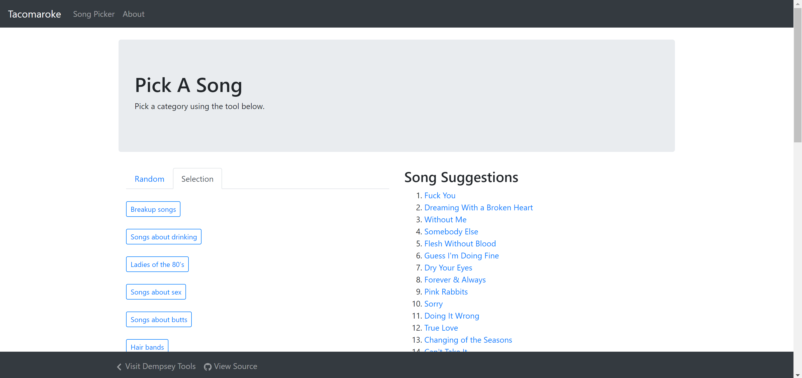

# Tacomaroke 

Tacomaroke is a website which help you find songs to sing tacomaroke. This is the source for the app, which uses amplify for managing the backend components, and the frontend is built in typescript using react. Backend storage components use Appsync for graphql.

.

## Start development

1. Install the [Amplify CLI](https://docs.amplify.aws/cli/start/install), Yarn, Node, and Git
1. Pull down this source code, and run `yarn install`
1. You'll need amplify configured to your account, then run `amplify pull`, if you're moving to a new account you'll need to run either  `amplify push` or `amplify env import` depending on the usecase.
1. Start the dev server with `yarn start`.

## Testing

Unit tests can be run via `yarn test`

## Deploying Changes

Changes are deployed by committing to the two branches in this package.

The `dev` branch will kick off a deployment to [dev.tacomaroke.com](https://dev.tacomaroke.com). _Note: the dev endpoint is password protected._

Once changes are manually verified in dev, kick off a merge commit to `release`, which will kick off a deployment to [tacomaroke.com](https://www.tacomaroke.com)
